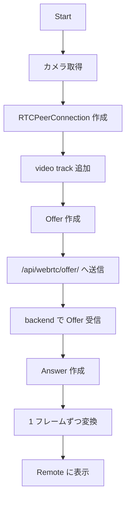

# webRTC-for-sever -webRTC-practice (forked from Kushina947/webRTC-practice)-

WebRTC の実験用アプリ。

- `backend`: Django + `aiortc`
- `frontend`: Vite + React + TypeScript

ブラウザのカメラ映像を backend に送り、backend から返ってきた映像を frontend に表示する構成。

## アーキテクチャ

役割は 2 つ。

- `frontend`: ブラウザ画面
- `backend`: WebRTC 受け取りと映像加工

WebRTC の接続先は `frontend` と `backend` の間。
最初の合図だけは HTTP。
`/api/webrtc/offer/` に Offer を送り、backend から Answer を返す流れ。

## 処理の流れ

1. ブラウザで `Start`
2. `frontend` でカメラ取得
3. `RTCPeerConnection` 作成
4. カメラの video track を WebRTC に追加
5. Offer 作成と backend 送信
6. backend で Offer 受信と Answer 作成
7. backend で 1 フレームずつグレースケール化
8. `frontend` で `Remote` 表示



## 起動方法

### Mac

#### 1. backend を起動する

初回のみ `migrate`

```bash
cd backend
source .venv/bin/activate
python manage.py migrate # 初回のみ
python manage.py runserver
```

backend の起動先: `http://127.0.0.1:8000/`

#### 2. frontend を起動する

別ターミナルで実行。

```bash
cd frontend
npm install
npm run dev
```

frontend の起動先: `http://localhost:5173/`

#### 3. ブラウザで開く

`http://localhost:5173/` を開いて `Start`

### Windows

#### 1. backend を起動する

PowerShell で実行。

初回のみ `migrate`

```powershell
cd backend
.\.venv\Scripts\Activate.ps1
python manage.py migrate # 初回のみ
python manage.py runserver
```

backend の起動先: `http://127.0.0.1:8000/`

#### 2. frontend を起動する

別ターミナルで実行。

```powershell
cd frontend
npm install
npm run dev
```

frontend の起動先: `http://localhost:5173/`

#### 3. ブラウザで開く

`http://localhost:5173/` を開いて `Start`

## 補足

- カメラ利用は `localhost` 前提
- `Stop` で接続終了
- 画面は `Local` と `Remote` の 2 枚

## 追記（高橋）
- 二つのPC間でやり取りする場合の接続方法
- 現在はDHCPを使用しているので，学内でできるかは不明
```bash
git clone https://github.com/takaaaa-jun/webRTC-for-server # forked from Kushina947/webRTC-practice
cd webRTC-for-server
git switch test_webRTCconnection

# backend
cd backend
python -m venv .venv
.venv/Scripts/activate
# source .venv/bin/activate
pip install -r requirements.txt

python manage.py migrate
python manage.py runserver 0.0.0.0:8000

# ターミナルを分割
# frontend
cd ..
cd frontend
npm install
npm run dev -- --host 0.0.0.0
```

- 最終的には，サーバを経由してアクセスできるようにする
```txt
カメラ用PC
  └─ localhost でカメラ起動
  └─ /send でサーバへ送信

サーバ
  └─ /send で受けた映像・骨格データを保持/中継
  └─ /view で視聴者に見せる

見る人のPC
  └─ パスワード認証
  └─ http://(IPアドレス)/view にアクセス
  └─ 映像のみ / 骨格のみ / 同時モードを切り替え
```